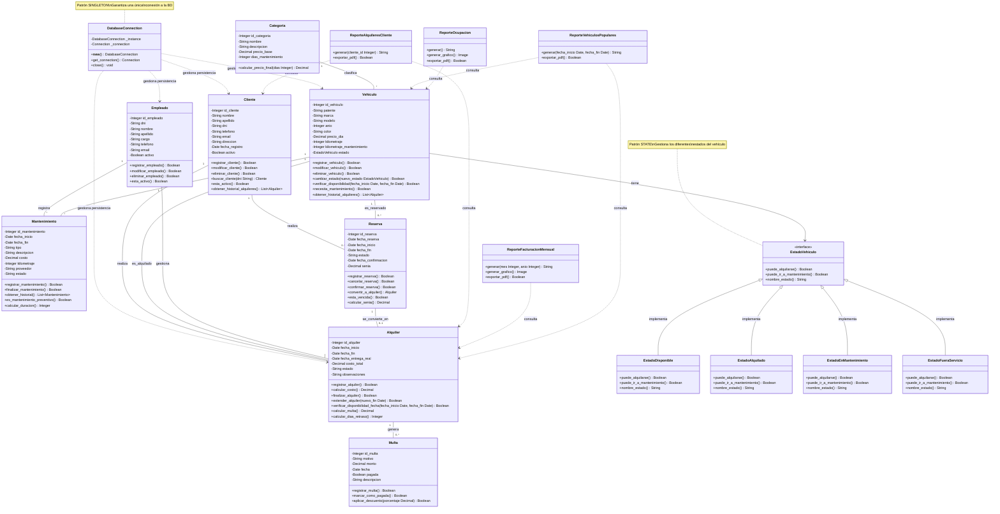

```mermaid
classDiagram
%% =================== PATRÓN SINGLETON ===================
    class DatabaseConnection {
        -DatabaseConnection _instance
        -Connection _connection
        +__new__() DatabaseConnection
        +get_connection() Connection
        +close() void
    }
    note for DatabaseConnection "Patrón SINGLETON\nGarantiza una única\nconexión a la BD"

%% =================== CLASES PRINCIPALES ===================
    class Cliente {
        -Integer id_cliente
        -String nombre
        -String apellido
        -String dni
        -String telefono
        -String email
        -String direccion
        -Date fecha_registro
        -Boolean activo
        +registrar_cliente() Boolean
        +modificar_cliente() Boolean
        +eliminar_cliente() Boolean
        +buscar_cliente(dni String) Cliente
        +esta_activo() Boolean
        +obtener_historial_alquileres() List~Alquiler~
    }

    class Empleado {
        -Integer id_empleado
        -String dni
        -String nombre
        -String apellido
        -String cargo
        -String telefono
        -String email
        -Boolean activo
        +registrar_empleado() Boolean
        +modificar_empleado() Boolean
        +eliminar_empleado() Boolean
        +esta_activo() Boolean
    }

    class Vehiculo {
        -Integer id_vehiculo
        -String patente
        -String marca
        -String modelo
        -Integer anio
        -String color
        -Decimal precio_dia
        -Integer kilometraje
        -Integer kilometraje_mantenimiento
        -EstadoVehiculo estado
        +registrar_vehiculo() Boolean
        +modificar_vehiculo() Boolean
        +eliminar_vehiculo() Boolean
        +cambiar_estado(nuevo_estado EstadoVehiculo) Boolean
        +verificar_disponibilidad(fecha_inicio Date, fecha_fin Date) Boolean
        +necesita_mantenimiento() Boolean
        +obtener_historial_alquileres() List~Alquiler~
    }

    class Categoria {
        -Integer id_categoria
        -String nombre
        -String descripcion
        -Decimal precio_base
        -Integer dias_mantenimiento
        +calcular_precio_final(dias Integer) Decimal
    }

    class Alquiler {
        -Integer id_alquiler
        -Date fecha_inicio
        -Date fecha_fin
        -Date fecha_entrega_real
        -Decimal costo_total
        -String estado
        -String observaciones
        +registrar_alquiler() Boolean
        +calcular_costo() Decimal
        +finalizar_alquiler() Boolean
        +extender_alquiler(nuevo_fin Date) Boolean
        +verificar_disponibilidad_fecha(fecha_inicio Date, fecha_fin Date) Boolean
        +calcular_multa() Decimal
        +calcular_dias_retraso() Integer
    }

    class Mantenimiento {
        -Integer id_mantenimiento
        -Date fecha_inicio
        -Date fecha_fin
        -String tipo
        -String descripcion
        -Decimal costo
        -Integer kilometraje
        -String proveedor
        -String estado
        +registrar_mantenimiento() Boolean
        +finalizar_mantenimiento() Boolean
        +obtener_historial() List~Mantenimiento~
        +es_mantenimiento_preventivo() Boolean
        +calcular_duracion() Integer
    }

    class Multa {
        -Integer id_multa
        -String motivo
        -Decimal monto
        -Date fecha
        -Boolean pagada
        -String descripcion
        +registrar_multa() Boolean
        +marcar_como_pagada() Boolean
        +aplicar_descuento(porcentaje Decimal) Boolean
    }

    class Reserva {
        -Integer id_reserva
        -Date fecha_reserva
        -Date fecha_inicio
        -Date fecha_fin
        -String estado
        -Date fecha_confirmacion
        -Decimal senia
        +registrar_reserva() Boolean
        +cancelar_reserva() Boolean
        +confirmar_reserva() Boolean
        +convertir_a_alquiler() Alquiler
        +esta_vencida() Boolean
        +calcular_senia() Decimal
    }

%% =================== PATRÓN STATE ===================
    class EstadoVehiculo {
        <<interface>>
        +puede_alquilarse() Boolean
        +puede_ir_a_mantenimiento() Boolean
        +nombre_estado() String
    }

    class EstadoDisponible {
        +puede_alquilarse() Boolean
        +puede_ir_a_mantenimiento() Boolean
        +nombre_estado() String
    }

    class EstadoAlquilado {
        +puede_alquilarse() Boolean
        +puede_ir_a_mantenimiento() Boolean
        +nombre_estado() String
    }

    class EstadoEnMantenimiento {
        +puede_alquilarse() Boolean
        +puede_ir_a_mantenimiento() Boolean
        +nombre_estado() String
    }

    class EstadoFueraServicio {
        +puede_alquilarse() Boolean
        +puede_ir_a_mantenimiento() Boolean
        +nombre_estado() String
    }

    Vehiculo --> EstadoVehiculo : tiene
    EstadoVehiculo <|-- EstadoDisponible : implementa
    EstadoVehiculo <|-- EstadoAlquilado : implementa
    EstadoVehiculo <|-- EstadoEnMantenimiento : implementa
    EstadoVehiculo <|-- EstadoFueraServicio : implementa

    note for EstadoVehiculo "Patrón STATE\nGestiona los diferentes\nestados del vehículo"

%% =================== MÓDULO DE REPORTES (SIN PATRÓN) ===================
    class ReporteAlquileresCliente {
        +generar(cliente_id Integer) String
        +exportar_pdf() Boolean
    }

    class ReporteFacturacionMensual {
        +generar(mes Integer, anio Integer) String
        +generar_grafico() Image
        +exportar_pdf() Boolean
    }

    class ReporteVehiculosPopulares {
        +generar(fecha_inicio Date, fecha_fin Date) String
        +exportar_pdf() Boolean
    }

    class ReporteOcupacion {
        +generar() String
        +generar_grafico() Image
        +exportar_pdf() Boolean
    }

%% =================== RELACIONES PRINCIPALES ===================
    DatabaseConnection ..> Cliente : gestiona persistencia
    DatabaseConnection ..> Empleado : gestiona persistencia
    DatabaseConnection ..> Vehiculo : gestiona persistencia
    DatabaseConnection ..> Alquiler : gestiona persistencia
    
    Cliente "1" -- "*" Alquiler : realiza
    Cliente "1" -- "0..*" Reserva : realiza
    Vehiculo "1" -- "*" Alquiler : es_alquilado
    Vehiculo "1" -- "0..*" Reserva : es_reservado
    Empleado "1" -- "*" Alquiler : gestiona
    Empleado "1" -- "*" Mantenimiento : registra
    Alquiler "1" -- "0..*" Multa : genera
    Vehiculo "1" -- "*" Mantenimiento : recibe
    Categoria "1" -- "*" Vehiculo : clasifica
    Reserva "1" -- "0..1" Alquiler : se_convierte_en
    
    ReporteAlquileresCliente ..> Alquiler : consulta
    ReporteAlquileresCliente ..> Cliente : consulta
    ReporteFacturacionMensual ..> Alquiler : consulta
    ReporteVehiculosPopulares ..> Vehiculo : consulta
    ReporteVehiculosPopulares ..> Alquiler : consulta
    ReporteOcupacion ..> Vehiculo : consulta
```