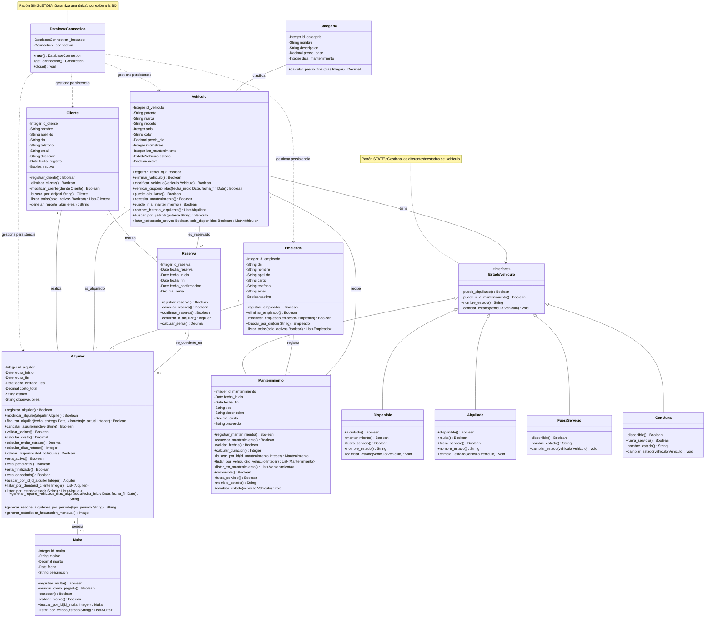

```mermaid
classDiagram
%% =================== PATRÓN SINGLETON ===================
    class DatabaseConnection {
        -DatabaseConnection _instance
        -Connection _connection
        +__new__() DatabaseConnection
        +get_connection() Connection
        +close() void
    }
    note for DatabaseConnection "Patrón SINGLETON\nGarantiza una única\nconexión a la BD"

%% =================== CLASES PRINCIPALES ===================
    class Cliente {
        -Integer id_cliente
        -String nombre
        -String apellido
        -String dni
        -String telefono
        -String email
        -String direccion
        -Date fecha_registro
        -Boolean activo
        +registrar_cliente() Boolean
        +eliminar_cliente() Boolean
        +modificar_cliente(cliente Cliente) Boolean
        +buscar_por_dni(dni String) Cliente
        +listar_todos(solo_activos Boolean) List~Cliente~
        +generar_reporte_alquileres() String
    }

    class Empleado {
        -Integer id_empleado
        -String dni
        -String nombre
        -String apellido
        -String cargo
        -String telefono
        -String email
        -Boolean activo
        +registrar_empleado() Boolean
        +eliminar_empleado() Boolean
        +modificar_empleado(empeado Empleado) Boolean
        +buscar_por_dni(dni String) Empleado
        +listar_todos(solo_activos Boolean) List~Empleado~
    }

    class Vehiculo {
        -Integer id_vehiculo
        -String patente
        -String marca
        -String modelo
        -Integer anio
        -String color
        -Decimal precio_dia
        -Integer kilometraje
        -Integer km_mantenimiento
        -EstadoVehiculo estado
        -Boolean activo
        +registrar_vehiculo() Boolean
        +eliminar_vehiculo() Boolean
        +modificar_vehiculo(vehiculo Vehiculo) Boolean
        +verificar_disponibilidad(fecha_inicio Date, fecha_fin Date) Boolean
        +puede_alquilarse() Boolean
        +necesita_mantenimiento() Boolean
        +puede_ir_a_mantenimiento() Boolean
        +obtener_historial_alquileres() List~Alquiler~
        +buscar_por_patente(patente String) Vehiculo
        +listar_todos(solo_activos Boolean, solo_disponibles Boolean) List~Vehiculo~
    }

    class Categoria {
        -Integer id_categoria
        -String nombre
        -String descripcion
        -Decimal precio_base
        -Integer dias_mantenimiento
        +calcular_precio_final(dias Integer) Decimal
    }

    class Alquiler {
        -Integer id_alquiler
        -Date fecha_inicio
        -Date fecha_fin
        -Date fecha_entrega_real
        -Decimal costo_total
        -String estado
        -String observaciones
        +registrar_alquiler() Boolean
        +modificar_alquiler(alquiler Alquiler) Boolean
        +finalizar_alquiler(fecha_entrega Date, kilometraje_actual Integer) Boolean
        +cancelar_alquiler(motivo String) Boolean
        +validar_fechas() Boolean
        +calcular_costo() Decimal
        +calcular_multa_retraso() Decimal
        +calcular_dias_retraso() Integer
        +validar_disponibilidad_vehiculo() Boolean
        +esta_activo() Boolean
        +esta_pendiente() Boolean
        +esta_finalizado() Boolean
        +esta_cancelado() Boolean
        +buscar_por_id(id_alquiler Integer) Alquiler
        +listar_por_cliente(id_cliente Integer) List~Alquiler~
        +listar_por_estado(estado String) List~Alquiler~
        +generar_reporte_vehiculos_mas_alquilados(fecha_inicio Date, fecha_fin Date) String
        +generar_reporte_alquileres_por_periodo(tipo_periodo String) String
        +generar_estadistica_facturacion_mensual() Image
    }

    class Mantenimiento {
        -Integer id_mantenimiento
        -Date fecha_inicio
        -Date fecha_fin
        -String tipo
        -String descripcion
        -Decimal costo
        -String proveedor
        +registrar_mantenimiento() Boolean
        +cancelar_mantenimiento() Boolean
        +validar_fechas() Boolean
        +calcular_duracion() Integer
        +buscar_por_id(id_mantenimiento Integer) Mantenimiento
        +listar_por_vehiculo(id_vehiculo Integer) List~Mantenimiento~
        +listar_en_mantenimiento() List~Mantenimiento~
    }

    class Multa {
        -Integer id_multa
        -String motivo
        -Decimal monto
        -Date fecha
        -String descripcion
        +registrar_multa() Boolean
        +marcar_como_pagada() Boolean
        +cancelar() Boolean
        +validar_monto() Boolean
        +buscar_por_id(id_multa Integer) Multa
        +listar_por_estado(estado String) List~Multa~
    }

    class Reserva {
        -Integer id_reserva
        -Date fecha_reserva
        -Date fecha_inicio
        -Date fecha_fin
        -Date fecha_confirmacion
        -Decimal senia
        +registrar_reserva() Boolean
        +cancelar_reserva() Boolean
        +confirmar_reserva() Boolean
        +convertir_a_alquiler() Alquiler
        +calcular_senia() Decimal
    }

%% =================== PATRÓN STATE ===================
    
    class EstadoVehiculo {
        <<interface>>
        +puede_alquilarse() Boolean
        +puede_ir_a_mantenimiento() Boolean
        +nombre_estado() String
        +cambiar_estado(vehiculo Vehiculo) void
    }

    class Disponible {
        +alquilado() Boolean
        +mantenimiento() Boolean
        +fuera_servicio() Boolean
        +nombre_estado() String
        +cambiar_estado(vehiculo Vehiculo) void
    }

    class Alquilado {
        +disponible() Boolean
        +multa() Boolean
        +fuera_servicio() Boolean
        +nombre_estado() String
        +cambiar_estado(vehiculo Vehiculo) void
    }

    class Mantenimiento {
        +disponible() Boolean
        +fuera_servicio() Boolean
        +nombre_estado() String
        +cambiar_estado(vehiculo Vehiculo) void
    }

    class FueraServicio {
        +disponible() Boolean
        +nombre_estado() String
        +cambiar_estado(vehiculo Vehiculo) void
    }

    class ConMulta {
        +disponible() Boolean
        +fuera_servicio() Boolean
        +nombre_estado() String
        +cambiar_estado(vehiculo Vehiculo) void
    }

    Vehiculo --> EstadoVehiculo : tiene
    EstadoVehiculo <|-- Disponible
    EstadoVehiculo <|-- Alquilado
    EstadoVehiculo <|-- Mantenimiento
    EstadoVehiculo <|-- FueraServicio
    EstadoVehiculo <|-- ConMulta

    note for EstadoVehiculo "Patrón STATE\nGestiona los diferentes\nestados del vehículo"

%% =================== RELACIONES PRINCIPALES ===================
    DatabaseConnection ..> Cliente : gestiona persistencia
    DatabaseConnection ..> Empleado : gestiona persistencia
    DatabaseConnection ..> Vehiculo : gestiona persistencia
    DatabaseConnection ..> Alquiler : gestiona persistencia
    
    Cliente "1" -- "*" Alquiler : realiza
    Cliente "1" -- "0..*" Reserva : realiza
    Vehiculo "1" -- "*" Alquiler : es_alquilado
    Vehiculo "1" -- "0..*" Reserva : es_reservado
    Empleado "1" -- "*" Alquiler : gestiona
    Empleado "1" -- "*" Mantenimiento : registra
    Alquiler "1" -- "0..*" Multa : genera
    Vehiculo "1" -- "*" Mantenimiento : recibe
    Categoria "1" -- "*" Vehiculo : clasifica
    Reserva "1" -- "0..1" Alquiler : se_convierte_en
```